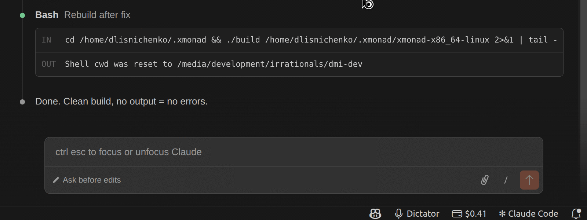

# Code Dictator

**Stop typing prompts. Start speaking them.**

You talk to AI all day. Claude, Copilot, Cursor, Windsurf — they all understand natural language. So why are you still typing at 70 words per minute when you speak at 150?

Press `Alt+D`. Speak. Press `Alt+D` again. Paste. Done.

Your words are transcribed in seconds, ready to paste into any AI chat, terminal, or editor. No browser extensions. No microphone setup. No dependencies to install. Just your voice and your code.

---

## Get Started in 30 Seconds

1. **Install** Code Dictator from the VS Code Marketplace
2. **Get a free API key** from [ElevenLabs](https://try.elevenlabs.io/rgoomc9z8dvv) — sign up, find **Developers** (bottom of the left panel) → **API Keys** → **Create API Key**
3. **Press `Alt+D`**, speak your prompt, press `Alt+D` again, and **paste** into any AI chat

That's it. Your voice → clipboard → wherever you need it.

---

## Why Voice Changes Everything

You spend hours a day writing prompts for AI coding assistants. That's not coding — that's copywriting. And you're doing it with a keyboard.

- **2x faster input.** A 30-second typed prompt takes 15 seconds to speak. Over a full day, that's 30-60 minutes back.
- **Code from anywhere.** Wireless headphones on, walk to the kitchen, dictate your next prompt while the coffee brews. Your AI assistant doesn't care where you are.
- **Better prompts.** When speaking is effortless, you give more context. More context means better AI output. Better output means fewer iterations.
- **Less fatigue.** Save your hands for what matters — reviewing diffs, navigating code, running commands. Let your voice handle the rest.

---

## Features

| | What you get |
|---|---|
| **Push-to-talk** | `Alt+D` to start, `Alt+D` to stop. Or hold-to-talk mode. |
| **Any AI assistant** | Claude, Copilot, Cursor, Windsurf, Cline, terminal — paste anywhere |
| **37 languages** | Auto-detected. Switch with one click. |
| **Code-aware mode** | Say "open paren" and get `(`. 50+ symbol mappings. |
| **AI text cleanup** | Optional LLM pass removes filler words and fixes grammar |
| **Noise reduction** | Built-in audio isolation — basic or aggressive |
| **Cost tracking** | See your spend in the status bar. Know exactly what you're paying. |
| **Zero dependencies** | ~130KB package. No sox, no ffmpeg, no Python. Just install and go. |
| **Cross-platform** | macOS, Windows, Linux. Native fallback on each. |
| **Privacy-first** | No telemetry. No data collection. API keys in your OS keychain. |

---

## Providers

| | ElevenLabs | OpenAI | Custom API |
|---|---|---|---|
| **Models** | Scribe v2, v1 | GPT-4o Transcribe, Whisper | Any Whisper-compatible |
| **Accuracy** | Excellent | Very good (GPT-4o) / Good (Whisper) | Model-dependent |
| **Languages** | 90+ | 57 | Varies |
| **Free tier** | **Yes** (2.5 hrs/month) | No | N/A |
| **Latency** | ~1-2s | ~1-3s | Varies |
| **Best for** | Most developers | Existing OpenAI users | Privacy / self-hosted |

We recommend **ElevenLabs** — it's the most accurate, has a generous free tier, and just works.

> [Sign up for ElevenLabs](https://try.elevenlabs.io/rgoomc9z8dvv) — free tier, no credit card required
>
> *Referral link — supports Code Dictator's development at no cost to you.*

---

## Pricing

Code Dictator is **free and open-source**. You only pay for the speech-to-text API:

| Provider | Cost |
|---|---|
| ElevenLabs | **Free tier** (2.5 hrs/month), then ~$0.40/hr |
| OpenAI Whisper | See [OpenAI pricing](https://openai.com/api/pricing/) |
| Custom / Local | Free |

Most developers stay comfortably within the free tier.

---

## Code-Aware Mode

When enabled (default), spoken programming terms become symbols:

| Say | Get |
|---|---|
| "open paren" | `(` |
| "close bracket" | `]` |
| "arrow function" | `=>` |
| "triple equals" | `===` |
| "new line" | *(line break)* |

50+ mappings. Say `"const items equals open bracket close bracket"` and get `const items = []`.

---

## Keyboard Shortcuts

| Action | Shortcut |
|---|---|
| Toggle recording | `Alt+D` |
| Cancel recording | `Escape` (while recording) |

Customize in Keyboard Shortcuts (`Ctrl+K Ctrl+S`). **For a true push-to-talk feel, rebind toggle recording to a single key you never use — `Pause/Break`, `ScrollLock`, or a spare mouse button work great as a dedicated dictation key.**

---

## All Settings

Settings are grouped into sections in the VS Code Settings UI.

**Speech Recognition**

| Setting | Default | Description |
|---|---|---|
| `provider` | `elevenlabs` | `elevenlabs`, `openai`, `custom` |
| `voiceModel` | `auto` | STT model (`auto`, `scribe_v2`, `whisper-1`, `gpt-4o-transcribe`, etc.) |
| `language` | *(auto)* | Language code or auto-detect |
| `preferredLanguages` | `[]` | Shortlist for quick switching |

**Text Processing**

| Setting | Default | Description |
|---|---|---|
| `textProcessing.codeAware` | `true` | Spoken-to-symbol conversion |
| `textProcessing.aiCleanup` | `false` | LLM cleanup (requires OpenAI key) |
| `textProcessing.aiModel` | `gpt-4.1-nano` | Model for text cleanup |

**Recording**

| Setting | Default | Description |
|---|---|---|
| `recording.mode` | `toggle` | `toggle` or `hold` |
| `recording.audioIsolation` | `basic` | `off`, `basic`, `aggressive` |
| `recording.maxDuration` | `300` | Max seconds (10-3600) |
| `recording.silenceTimeout` | `0` | Auto-stop on silence (0 = off) |

**Output**

| Setting | Default | Description |
|---|---|---|
| `output.target` | `clipboard` | `clipboard` or `editor` |
| `output.autoCopy` | `true` | Also copy to clipboard |

**Feedback**

| Setting | Default | Description |
|---|---|---|
| `feedback.showCost` | `true` | Cost in status bar |
| `feedback.transcriptionSound` | `false` | Chime on completion |

All settings under the `codeDictator.*` namespace.

---

## How It Works

Code Dictator records via the browser's MediaRecorder API in a hidden WebView — zero native dependencies on macOS and Windows. On Linux, it auto-detects when WebView mic permissions are sandboxed and falls back to `arecord` (pre-installed on most distros). You don't configure anything; it just works.

**Adaptive silence detection** (when enabled) uses dual exponential moving averages to track your noise floor and speech energy in real-time. No calibration needed — it adapts to your microphone and environment automatically. See the [technical reference](docs/voice-activity-detection.md) for details.

---

## Filler Word Removal

Automatic, free, no API needed. Covers 90+ languages — English `uh/um/er`, German `äh/ähm`, French `euh/heu`, Russian `ну/значит`, Japanese `えーと/あの`, and many more.

For deeper cleanup (rephrasing, grammar), enable **AI text cleanup** which uses an OpenAI LLM.

---

## Troubleshooting

**Why isn't there a microphone button inside AI chat windows?**
VS Code's Extension API does not allow extensions to inject buttons, icons, or any custom UI into another extension's chat panel. Each extension's views are sandboxed — there is no API for a third-party extension to modify the Claude, Copilot, or any other chat interface. This is a VS Code platform limitation, not something any extension can work around. The keyboard shortcut (`Alt+D`) and the status bar microphone button work universally across all contexts — click into the chat input, press `Alt+D`, speak, and paste. No in-panel button needed.

**Microphone not detected**
- macOS: System Settings → Privacy & Security → Microphone → enable VS Code
- Windows: Settings → Privacy → Microphone → allow app access
- Linux: Check PulseAudio/PipeWire with `pavucontrol`

**Recording fails in Remote / SSH / WSL**
Voice input requires a local VS Code window. Remote environments don't expose microphone access to extensions.

**Transcription comes back empty**
- Test your microphone in another app first
- Verify your API key: run `Code Dictator: Set API Key` from the Command Palette

**Short phrases transcribed in the wrong language?**
Speech-to-text models use context to identify the language. Longer utterances give the model more signal, so full sentences ("Refactor the auth middleware to use JWT tokens and add rate limiting") are transcribed accurately almost every time. Shorter phrases — around five words or fewer — may not contain enough context for reliable language detection. If you frequently dictate short commands, try setting a specific language in settings instead of relying on auto-detect. Alternatively, configure your **Preferred Languages** list — when AI text cleanup is enabled, it uses this list as a language hint to avoid unwanted language switches.

---

## Privacy

- API keys stored in your OS keychain — never on disk in plaintext
- Audio sent only to your configured provider
- No telemetry, no analytics, no data collection
- No audio retained after transcription

---

## Contributing

[Open an issue](https://github.com/Dmitriusan/code-dictator/issues) to discuss changes. PRs welcome.

---

## License

MIT — see [LICENSE](LICENSE).

---

If Code Dictator saves you time, consider [buying me a coffee](https://buymeacoffee.com/dmitriusan).

Built by [Dmytro Lisnichenko](https://github.com/Dmitriusan) · [irrationalways.com](https://irrationalways.com)
